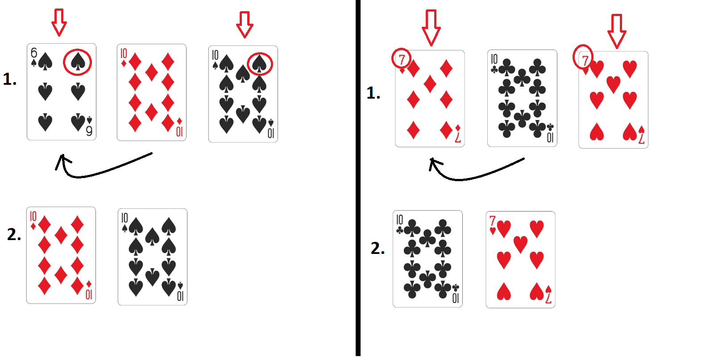

# Solitaire
This code is one of the first I wrote.  
I was about 14 years old and just starting to discover programming.   
Mom taught me how to play card solitaire, and when I was bored I would sit with a deck of cards and try to fold it.   
However, over and over again the combination of cards turned out to be unsuccessful,   
and it began to seem to me that it was impossible to fold it. Then I wrote a small program that automatically   
played a huge number of solitaire games and counted the winning percentage.   
As a result, I got a probability of winning of approximately 0.0075. This explained my such a low winning percentage :)  
The rules of that solitaire game are given below:
### Rules
The game is played using a deck of 36 cards.  
Cards are laid out on the table alternately from left to right, and after laying out a card, we look at the last three cards laid out.  
If in a three of cards the outer ones belong to the same suit or have the same value, then the central card in the three is placed on top of the left one.  
Further, since one card disappeared, we could have new combinations, and we look for them in the laid out cards and add them up according to the same principle.  
Sometimes 1 needed card starts a giant chain of combinations.  
If we are sure that there is no combination in any of the three adjacent cards in front of us, we lay out a card from the deck.  
The game ends when the cards in the main deck run out. If there are only 2 cards on the table in front of us, then we win, if more, we lose.  
Example:

  

